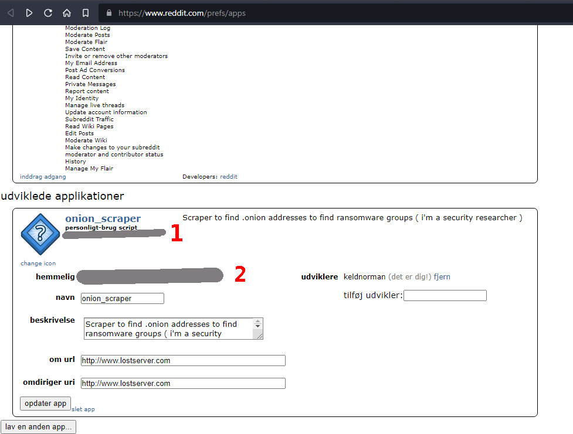

# reddit_onion_scraper
Scrape tor/darkweb onion adresses from Reddit stream via API 

Pre: pip3 install praw ( perhaps also first install pip : apt-get install python3-pip )

You need to create a developer account on Reddit first here: https://www.reddit.com/prefs/apps

Then fill out this inside of the python file: 

client_id = 'r00SoMeLettersAndStuff'                 <-- See the image where i marked the number 1
user_agent = 'Finding onions (by u/your_name)'       <-- Whatever you like here
client_secret = 'HeReIs30CharsFromTheDevWebPage'     <-- See the image where i marked the number 2

Then just execute the script

chmod +x ./scraper.py 
./scraper.py
